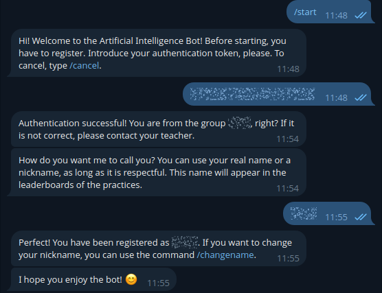
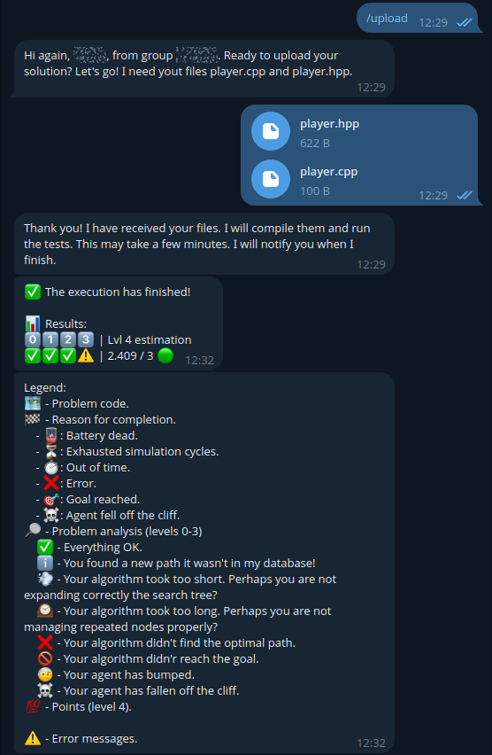
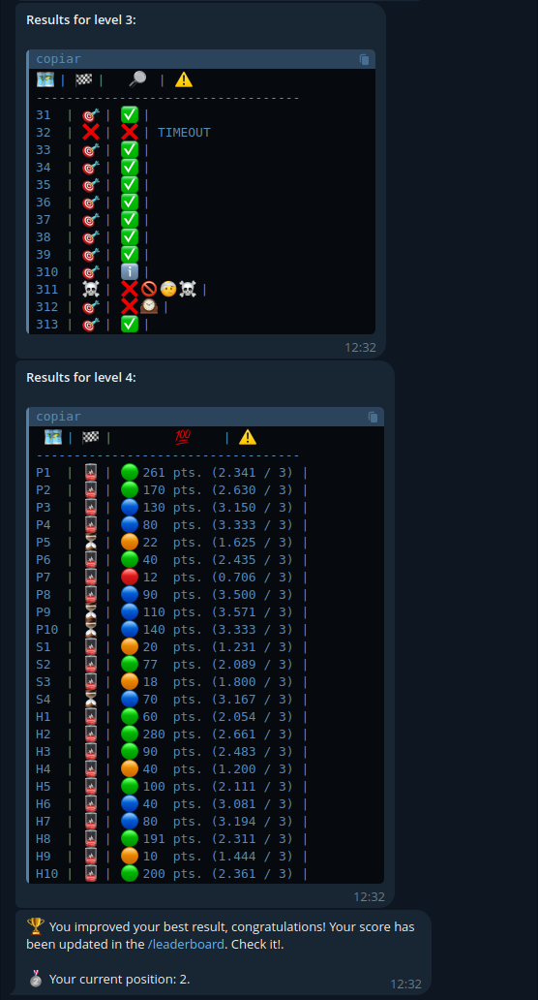
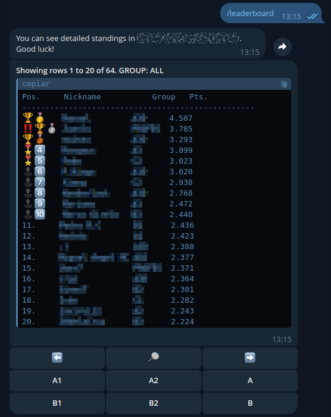
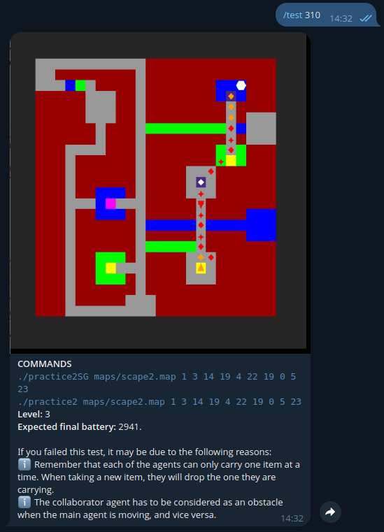
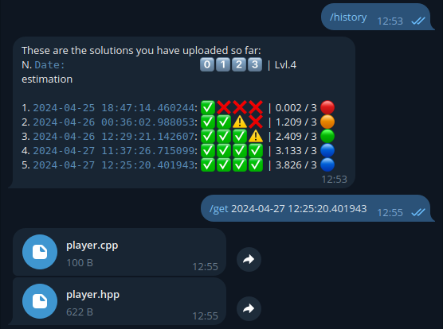

# IA-BOT-UGR-24
Bot used during Artificial Intelligence practices at UGR during the course 2023/2024 🫡❤️

## Requirements
- `python` (v 3.8)
- `python-telegram-bot` (v 20.2)
- `requests` (v 2.28.2)
- `bash`
- `slurm`
- ...

## Description

This bot is designed to be run on a cluster that uses `slurm` as a queue manager. The bot is a permanent process (the `bot.py` scripts) that runs on a cluster node, and receives user requests through `Telegram`. It is responsible for managing requests, and sending them to the queue manager to be executed in the cluster one by one.

*This bot is a significantly enhanced version of the original bot presented during the course 2022/2023, [IA-BOT-UGR-23](https://github.com/jlsuarezdiaz/IA-BOT-UGR-23).*

## Examples

### Registration

The first interaction with the bot. A token is used to check if the user actually belongs to the subject. After that, they can use all the functionalities provided.

### Code submission

The process for a code submission. The bot asks the students for their code and then starts running it. It will notify the user when the results are ready.

### Results

After all the tests are completed, the bot shows the results obtained. A nice feedback to keep improving the work.

### Leaderboard

Every practice has its own leaderboard, where students can compete for fun and then check their results.

### Tests

Check the tests that the bot will run on the code. This way, students can know what to expect and find out possible errors.

### History of submissions

The bot keeps track of all the submissions made by the students. This way, they can check their progress and retrieve previous submissions if needed.

## Acknowledgements

To [@rbnuria](https://github.com/rbnuria), the best teacher mate ever, and to all the students who have motivated me to keep improving this bot.
